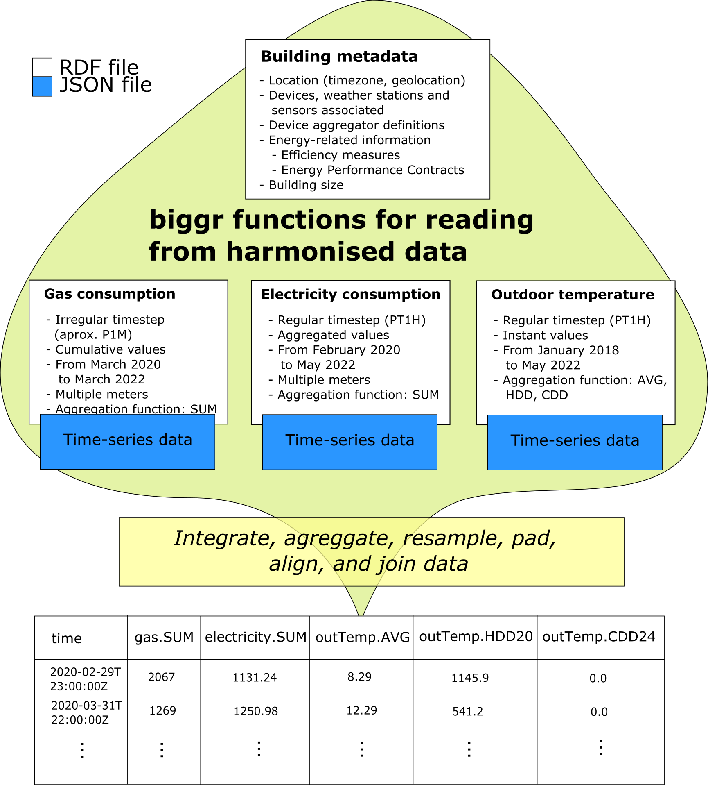

Along this vignette, the implementation of the longitudinal benchmarking used in Business Case 1 of the BIGG project is represented. This methodology basically consists on the statistical modelling of the general consumption of a building using weather and calendar features as inputs. Afterwards, the model is used to calculate energy usage indicators that are compared over the time.

```{r, include = FALSE}
knitr::opts_chunk$set(
  collapse = TRUE,
  comment = "#>"
)
```

# Load libraries

The 'biggr' package and other R packages are loaded to be used along this script. Besides, the configuration of the MLFlow infrastructure is set.

```{r error=F, warning=F, message=F}
library(biggr)
library(data.table)
library(ggplot2)
library(gridExtra)
library(plotly)
library(padr)
library(htmlwidgets)
library(carrier)
library(mlflow)
library(fs)
library(tidyr)
mlflow_wd = as.character(path_home("PyVenvs/mlflow"))
Sys.setenv(MLFLOW_PYTHON_BIN=paste0(mlflow_wd,"/bin/python3"))
Sys.setenv(MLFLOW_TRACKING_URI="http://127.0.0.1:5000")
Sys.setenv(MLFLOW_VERBOSE=FALSE)
Sys.setenv(MLFLOW_BIN=paste0(mlflow_wd,"/bin/mlflow"))
#mlflow_client(mlflow_set_tracking_uri("http://127.0.0.1:5000"))
```

# Read the harmonised data

Read the following files:

* RDF file containing the general information of buildings, devices and their metadata
```
@prefix ns0: <https://bigg-project.eu/ontology#> .
@prefix ns1: <https://sws.geonames.org> .

<https://icaen.cat#BUILDING-00109> a ns0:Building ;
    ns0:buildingIDFromOrganization "00109" ;
    ns0:buildingName "Institut Eugeni d`Ors" ;
    ns0:buildingUseType "Others" ;
    ns0:hasCadastralInfos <https://icaen.cat#5276508DF3857E0001ES> ;
    ns0:hasLocationInfo <https://icaen.cat#LOCATION-00109> ;
    ns0:hasSpace <https://icaen.cat#BUILDINGSPACE-00109> .

<https://icaen.cat#5276508DF3857E0001ES> a ns0:CadastralInfo ;
    ns0:landArea "8723.0" ;
    ns0:landCadastralReference "5276508DF3857E0001ES" ;
    ns0:landType "Urban" .

<https://icaen.cat#AREA-GrossFloorArea-GPG-00109> a ns0:Area ;
    ns0:areaType "GrossFloorArea" ;
    ns0:areaUnitOfMeasurement "m2" ;
    ns0:areaValue "10279.0" .
```
* JSON file containing the time series of each metering device related with buildings.
```
{
  "941898a024310399210beb4d7f7bb890c568714cc006e7e6429cc6869ccb215c": [
    {
      "start": "2020-11-11T23:00:00Z",
      "end": "2020-11-12T00:00:00Z",
      "value": 0
    },
    {
      "start": "2020-11-12T00:00:00Z",
      "end": "2020-11-12T01:00:00Z",
      "value": 200
    },
    {
      "start": "2020-11-12T01:00:00Z",
      "end": "2020-11-12T02:00:00Z",
      "value": 245
    },
    {
      "start": "2020-11-12T02:00:00Z",
      "end": "2020-11-12T03:00:00Z",
      "value": 175
    }
  ],
  "123155674310399210beb4d7f7bb890c568714cc006e7e6429cc6869ccb215c": [
    {
      "start": "2020-11-11T23:00:00Z",
      "end": "2020-11-12T00:00:00Z",
      "value": 0.1
    },
    {
      "start": "2020-11-12T00:00:00Z",
      "end": "2020-11-12T01:00:00Z",
      "value": 12
    },
    {
      "start": "2020-11-12T01:00:00Z",
      "end": "2020-11-12T02:00:00Z",
      "value": 14.5
    },
    {
      "start": "2020-11-12T02:00:00Z",
      "end": "2020-11-12T03:00:00Z",
      "value": 81.2
    }
  ]
}
```

The 'biggr' library contains functionalities to automatically, join, resample, pad and align multiple time-series and building static data, considering the metadata condensed in the RDF files and the time-series data contained in the JSON file.

{width=70% height=70%}

```{r}
buildingsRdf <- suppressMessages(rdf_parse("../data/one_building2.ttl", format = "turtle"))
timeseriesObject <- jsonlite::fromJSON("../data/one_building_series2.json")

buildings_df <- get_device_aggregators_by_building(
  buildingsRdf, timeseriesObject, 
  allowedBuildingId=c("00109"), 
  allowedDeviceAggregators=c("totalElectricityConsumption","outdoorTemperature"), 
  useEstimatedValues=F, ratioCorrection=T)
```

## Get the data for a specific building

Select a specific buildingId and build the dataset used in the analytics process.

```{r}
buildingId <- "00109"
df <- data.frame(
  "time" = buildings_df[[buildingId]]$time,
  "temperature" = buildings_df[[buildingId]]$outdoorTemperature.AVG,
  "Qe" = buildings_df[[buildingId]]$totalElectricityConsumption.SUM)
df$Qe[df$time>as.POSIXct("2021-09-30 22:00:00") &
        df$time<as.POSIXct("2021-11-30 23:00:00")] <- NA
```

Add the calendar features to the dataset using the timezone contained in the RDF for that building.

````{r}
tz <- get_tz_building(buildingsRdf, buildingId)
holidays_dates <- detect_holidays_in_tertiary_buildings(df, "Qe", "time", tz=tz)

df <- df %>% calendar_components(
  localTimeZone = tz, 
  holidays = holidays_dates
)

ggplotly(
  ggplot(df[df$time>min(df$time[is.finite(df$Qe)],na.rm=T),]) + geom_line(aes(time,Qe)) +
    geom_point(data=df[df$isHolidays==T,],mapping = aes(time,Qe),col="red")
)
```

## Plot the data

In the following chunk, the total electricity consumption and the outdoor temperature signals are plotted over time.
```{r}
#df$Qe <- ifelse(df$localtime>=as.POSIXct("2021-06-01 00:00:00",tz="Europe/Madrid"),df$Qe/0.8,df$Qe)
#df$Qe <- ifelse(df$localtime>=as.POSIXct("2021-06-01 00:00:00",tz="Europe/Madrid"),df$Qe*0.8,df$Qe)
ts_p <- ggplot(
    reshape2::melt( df %>% select(time, Qe, temperature) %>% pad(), 
                    "time")
  ) + 
  geom_line(
    aes(time,value)
  ) + 
  facet_wrap(~variable, scales = "free_y", ncol=1) +
  theme_bw()
ts_p <- ggplotly(ts_p)
ts_p
```

Then, with the objective of understanding the relation between the electricity consumption and the outdoor temperature, a scatter plot of the electricity consumption and outdoor temperature is depicted.

```{r}
grid.arrange(
  ggplot(df[,c("temperature","Qe")])+
      geom_point(
        aes(temperature, Qe),
        size=0.05
    )
)
```

Additionally, the complete set of daily / weekly load curves are plotted to visually check the existance of difference energy usage profiles.

```{r}
# Daily profiles
ggplot(df) + 
  geom_line(
    aes(hour, Qe, group=date),
    alpha=0.05
  ) + xlab("hour of the day")
```

```{r}
# Weekly profiles
ggplot(df) + 
  geom_line(
    aes(weekhour, Qe, group=paste(strftime(localtime,"%Y"),strftime(localtime,"%U"))),
    alpha=0.1
  ) + xlab("hour of the week")
```


# Clustering the daily load curves

In order to estimate, and consider during the data modelling, different patterns in daily load curves, such as weekend / weekdays patterns or holidays, a clustering is performed. This process will detect the most common daily load curves and classifies each day to each of the categories detected.

```{r}
clust <- clustering_dlc(
  data = df,
  consumptionFeature = "Qe", 
  outdoorTemperatureFeature = "temperature", 
  localTimeZone = "Europe/Madrid",
  kMax = 8, 
  inputVars = c("loadCurves","dailyConsumption","dailyHolidays"),
  loadCurveTransformation = "relative",
  holidaysDates = holidays_dates,
  nDayParts = 24
)
if("s" %in% colnames(df))
  df <- df %>% select(-s) 
df <- df %>% left_join(clust$dailyClassification)
df <- df[!is.na(df$s),]
```

```{r}
p <- ggplotly(
  ggplot(df) + 
    geom_line(
      aes(hour, Qe, group=date, col=s),
      alpha=0.05
    ) + 
    xlab("hour of the day") + 
    facet_wrap(~s) +
    theme_bw()
  )
saveWidget(p, "clustering_dlc.html", selfcontained = T)
p
```

# Filter the consumption outliers

In order to improve the modelling performance, the days with outliers are not considered. The methodology used to detect them is a calendar-based quantile regression model.

```{r}
if(all(c("value","window") %in% colnames(df)))
  df <- df %>% select(-value, -window) 
df <- df %>%
  select(!(contains("outliers") | contains("upperPredCalendarModel") | 
             contains("lowerPredCalendarModel"))) %>%
  left_join(
    detect_ts_calendar_model_outliers(data = ., 
                                      localTimeColumn = "localtime", 
                                      valueColumn = "Qe", 
                                      calendarFeatures = c("HOL","H"),
                                      upperModelPercentile = 90,
                                      lowerModelPercentile = 10,
                                      upperPercentualThreshold = 75,
                                      lowerPercentualThreshold = 25,
                                      window = 6*31*24*60*60, 
                                      outputPredictors = T,
                                      holidaysCalendar = holidays_dates,
                                      logValueColumn = T),
    by = "localtime"
  )
g <- ggplot(df[,c("localtime","Qe","outliers","upperPredCalendarModel","lowerPredCalendarModel")]) +
           geom_line(aes(localtime,Qe)) +
           geom_ribbon(aes(localtime,ymax=upperPredCalendarModel,ymin=lowerPredCalendarModel),
                       col="blue",alpha=0.5)
if(!all(df$outliers==F)) g <- g + geom_point(aes(localtime,ifelse(outliers,Qe,NA)),col="yellow")
outliers_plot <- g %>% ggplotly()
saveWidget(outliers_plot, "outliers_plot.html", selfcontained = T)
outliers_plot
```

# Initialize an MLFlow experiment

Start or continue an MLFlow experiment using the buildingId as the name of the experiment 

```{r}
experimentId <- tryCatch(
  mlflow_create_experiment(buildingId, artifact_location = paste0(mlflow_wd,"/mlruns")),
  error = function(e){
    experiment <- mlflow_get_experiment(name=buildingId)
    if (experiment$lifecycle_stage!="active") mlflow_restore_experiment(experiment$experiment_id)
    experiment$experiment_id
  }
)
```

# Configuration of the data transformation processes

Firstly, estimate the change point temperature of the building and check if weather dependence during heating or cooling period exists.

```{r}
wdep <- do.call(rbind,lapply(FUN = function(x){
    unlist(get_change_point_temperature(
      consumptionData = df[df$isHolidays==x,c("time","Qe")],
      weatherData =  df[df$isHolidays==x,c("time","temperature")],
      consumptionFeature = "Qe",
      temperatureFeature = "temperature",
      localTimeZone = "Europe/Madrid",
      plot=T
    ))
  }, levels(df$isHolidays)))
wdep = as.list(setNames(matrixStats::colMeans2(wdep),c("tbal","heating","cooling")))
wdep$heating <- wdep$heating > 0
wdep$cooling <- wdep$cooling > 0
```

Then, set initial values for the data transformation parameters.

```{r}
#    nhar tbalh tbalc maxh maxc alpha   lambda
# 54    6     9    13   50   50   0.9 0.999558
general_params <- list(
      "nhar"=list(
        "class"="integer",
        "values"=6#c(5,6)
      ),
      "tbalh"=list(
        "class"="float",
        "values"=seq(round(wdep$tbal,0)-4,round(wdep$tbal,0)+4,by=2)
      ),
      "tbalc"=list(
        "class"="float",
        "values"=seq(round(wdep$tbal,0)-4,round(wdep$tbal,0)+4,by=2)
      ),
      "maxh"=list(
        "class"="float",
        "values"=c(50)
      ),
      "maxc"=list(
        "class"="float",
        "values"=c(50)
      ),
      "alpha"=list(
        "class"="float",
        "values"=c(0.95)
      ),
      "lambda"=list(
        "class"="float",
        "values"=c(get_lpf_smoothing_time_scale(data.frame("time"=df$time),8640)
          #24*30*if(length(unique(df$monthInt))<12){length(unique(df$monthInt))}else{12})
        )
      )
    )
```

Afterwards, the data transformation operations that need to be done over the initial dataset, either in training or prediction mode, are described. This operations can contain parameters specified in general_params, always refering to them as param\$<variable>, e.g. param\$nhar.

```{r}
general_transformationSentences <- list(
     # Generate a fake dayType variable
     "dayType" = "vectorial_transformation(
                   as.factor(
                    ifelse(isHolidays==T,'holidays',
                     as.character(weekday))
                   ), outputFeatureName = 'dayType'
                 )",
  
     # Fourier series components of the hour of the day by weekdays and weekends. 
     "weekhour" = c(
       "fs_components(...,featuresName='hour',nHarmonics=param$nhar,inplace=F)",
       "isHolidays"
     ),
     
     # Fill some gaps in the outdoor temperature time series.
     "temperature" = "vectorial_transformation(
                        na.locf(
                          na.locf(
                            na.approx(temperature,na.rm = F),
                            fromLast = T,na.rm = T
                          ),
                          na.rm=T),
                      outputFeatureName='temperature')",
     
     # Low Pass Filtered (LPF) outdoor temperature
     "tlpf" = "lpf_ts(...,featuresNames='temperature',smoothingTimeScaleParameter=param$alpha,
                outputFeaturesNames='temperatureLpf')",
     
     # Estimate the heating degrees based on a heating balance temperature 
     # and the LPF temperature series
     "heatingLpf" = "degree_raw(...,featuresName='temperatureLpf',baseTemperature=param$tbalh,
                      mode='heating',outputFeaturesName='heatingLpf',maxValue=param$maxh,
                      inplace=F)",
     
     # Estimate the cooling degrees based on a cooling balance temperature 
     # and the LPF temperature series
     "coolingLpf" = "degree_raw(...,featuresName='temperatureLpf',baseTemperature=param$tbalc,
                      mode='cooling',outputFeaturesName='coolingLpf',maxValue=param$maxc,
                      inplace=F)",
     
     # Squared versions of the heating and cooling degrees
     "heatingLpf2" = "vectorial_transformation(heatingLpf^2,outputFeatureName='heatingLpf2')",
     "coolingLpf2" = "vectorial_transformation(coolingLpf^2,outputFeatureName='coolingLpf2')",
     
     # Check if exists heating or cooling degrees at every timestep 
     "heatingLpfBool" = "vectorial_transformation(ifelse(heatingLpf>0,1,0),
                          outputFeatureName='heatingLpfBool')",
     "coolingLpfBool" = "vectorial_transformation(ifelse(coolingLpf>0,1,0),
                          outputFeatureName='coolingLpfBool')",
     
     # Regression components for the heating degrees depending on the hour of the day 
     #and weekday/weekend
     "th"=c("heatingLpf",
            "fs_components(...,featuresName='hour',nHarmonics=param$nhar,inplace=F)",
            "isHolidays"
            ),
     
     # Regression components for the cooling degrees depending on the hour of the day 
     # and weekday/weekend
     "tc"=c("coolingLpf",
            "fs_components(...,featuresName='hour',nHarmonics=param$nhar,inplace=F)",
            "isHolidays"
            ),
     
     # Regression components for the heating degrees depending on the hour of the day 
     #and weekday/weekend
     "th2"=c("heatingLpf2",
            "fs_components(...,featuresName='hour',nHarmonics=param$nhar,inplace=F)",
            "isHolidays"
            ),
     
     # Regression components for the cooling degrees depending on the hour of the day 
     # and weekday/weekend
     "tc2"=c("coolingLpf2",
            "fs_components(...,featuresName='hour',nHarmonics=param$nhar,inplace=F)",
            "isHolidays"
            ),
     
     # Regression components for the heating intercept depending on the hour 
     # of the day and weekday/weekend
     "thint"=c("heatingLpfBool",
            "fs_components(...,featuresName='hour',nHarmonics=param$nhar,inplace=F)",
            "isHolidays"
            ),
     
     # Regression components for the cooling intercept depending on the hour 
     # of the day and weekday/weekend
     "tcint"=c("coolingLpfBool",
            "fs_components(...,featuresName='hour',nHarmonics=param$nhar,inplace=F)",
            "isHolidays"
           )
    )
```

Finally, a training control sentence is defined to specify the validation methology that needs to be used. In this case, a time-slice cross-validation is performed.

```{r}
trControl <- #trainControl(method="none")
      if(nrow(df) >= hourly_timesteps(1.5*365*24,detect_time_step(df$time))){
        trainControl(method = "timeslice",
                     initialWindow = hourly_timesteps(365*24,detect_time_step(df$time)),
                     horizon = hourly_timesteps(3*31*24,detect_time_step(df$time)),
                     skip = hourly_timesteps(365/2*24,detect_time_step(df$time))-1,
                     fixedWindow = T#,
                     # summaryFunction = regression_metrics
                     )
      } else {
        trainControl(method = "timeslice",
                   initialWindow = ceiling(0.50*nrow(df)),
                   horizon = ceiling(0.2*nrow(df)),
                   skip = ceiling(0.2*nrow(df))+1,
                   fixedWindow = F#,
                   # summaryFunction = regression_metrics
                   )
      }
```

# Data modelling 

Adjust a time-varying regression model - Recursive Least Squares (RLS) - to the data, considering the data transformation sentences, the weather dependence characteristics and the general parameters defined above.

Steps:

* Train the model and optimise the parameters using the validation techniques chosen in trControl.

* Create the predictor used by MLFlow containing the trained model and all its requirements.

* Compute interactive plots related with the trained model.

* Compute the errors related to the model.

* Load all the information to MLFlow.

```{r}
with(mlflow_start_run(experiment_id = experimentId),{
  
  if(wdep$heating && wdep$cooling){
    params <- general_params[c("nhar","tbalh","tbalc","maxh","maxc","alpha","lambda")]
    transformationSentences <- general_transformationSentences[
      c("dayType","weekhour","temperature","tlpf","heatingLpf","coolingLpf",
        "heatingLpf2","coolingLpf2","heatingLpfBool","coolingLpfBool",
        "th","tc","th2","tc2","tcint","thint")
    ]
    mod <- train(
      Qe ~ weekhour + th + tc,
      data=df[df$outliers==F,],
      method = RLS(
       data.frame(parameter = names(params),
                  class = mapply(params,FUN=function(i)i[["class"]]))
      ),
      tuneGrid = do.call(expand.grid,
                         lapply(params,function(i)i[["values"]])),
      trControl = trControl,
      # maxPredictionValue = max(df[df$outliers==F,"Qe"],na.rm=T) * 1.05,
      logOutput = T,
      minMonthsTraining = 12,
      continuousTime = T,
      transformationSentences = transformationSentences
    )
  } else if (wdep$heating){
    params <- general_params[c("nhar","tbalh","maxh","alpha","lambda")]
    transformationSentences <- general_transformationSentences[
        c("dayType","weekhour","temperature","tlpf","heatingLpf","heatingLpf2",
          "heatingLpfBool","th","th2","thint")
      ]
    mod <- train(
      Qe ~ weekhour + th,
      data=df[df$outliers==F,],
      method = RLS(
       data.frame(parameter = names(params),
                  class = mapply(params,FUN=function(i)i[["class"]]))
      ),
      tuneGrid = do.call(expand.grid,
                         lapply(params,function(i)i[["values"]])),
      trControl = trControl,
      # maxPredictionValue = max(df[df$outliers==F,"Qe"],na.rm=T) * 1.05,
      logOutput = T,
      minMonthsTraining = 12,
      continuousTime = T,
      transformationSentences = transformationSentences
    )
  } else if (wdep$cooling){
    params <- general_params[c("nhar","tbalc","maxc","alpha","lambda")]
    transformationSentences <- general_transformationSentences[
      c("dayType","weekhour","temperature","tlpf","coolingLpf","coolingLpf2",
        "coolingLpfBool","tc","tc2","tcint")
    ]
    mod <- train(
      Qe ~ weekhour + tc,
      data=df[df$outliers==F,],
      method = RLS(
       data.frame(parameter = names(params),
                  class = mapply(params,FUN=function(i)i[["class"]]))
      ),
      tuneGrid = do.call(expand.grid,
                         lapply(params,function(i)i[["values"]])),
      trControl = trControl,
      # maxPredictionValue = max(df[df$outliers==F,"Qe"],na.rm=T) * 1.05,
      logOutput = T,
      minMonthsTraining = 12,
      continuousTime = T,
      transformationSentences = transformationSentences
    )
  } else {
    params <- general_params[c("nhar","lambda")]
    transformationSentences <- general_transformationSentences[
      c("dayType","weekhour")
    ]
    mod <- train(
      Qe ~ weekhour,
      data=df[df$outliers==F,],
      method = RLS(
       data.frame(parameter = names(params),
                  class = mapply(params,FUN=function(i)i[["class"]]))
      ),
      tuneGrid = do.call(expand.grid,
                         lapply(params,function(i)i[["values"]])),
      trControl = trControl,
      # maxPredictionValue = max(df[df$outliers==F,"Qe"],na.rm=T) * 1.05,
      logOutput = T,
      minMonthsTraining = 12,
      continuousTime = T,
      transformationSentences = transformationSentences
    )
  }
  
  # Generate the predictor object
  predictor <- crate(function(x, forceGlobalInputFeatures = NULL,modelMinMaxHorizonInHours=1,
                              modelWindow="%Y-%m-%d", modelSelection="rmse"){
    biggr::predict.train(
      object = !!mod, 
      newdata = x, 
      forceGlobalInputFeatures = forceGlobalInputFeatures,
      modelMinMaxHorizonInHours = modelMinMaxHorizonInHours,
      modelWindow = modelWindow,
      modelSelection = modelSelection
    )
  })
  
  # Predict with the validation set
  df_for_pred <- df[
    # if(nrow(df) >= hourly_timesteps(mod$finalModel$meta$minMonthsTraining*2*30*24,
    #                                 detect_time_step(df$time))){
    #   df$time >= (min(df$time,na.rm=T) + days(mod$finalModel$meta$minMonthsTraining*2*30))
    # } else 
    if (nrow(df) >= hourly_timesteps(mod$finalModel$meta$minMonthsTraining*30*24,
                                    detect_time_step(df$time))) {
      df$time >= (min(df$time,na.rm=T) + days(mod$finalModel$meta$minMonthsTraining*30))
    } else {
      df$time >= quantile(df$time,0.3,na.rm=T)
    }, ]
  df_for_pred <- df_for_pred[order(df_for_pred$time),]
  df_for_pred$Qe_pred <- predictor(df_for_pred)
  
  # Generate the prediction plot, comparing with the actual data
  ggplotly(
    ggplot() +
      geom_line(aes(mod$finalModel$localtime, mod$finalModel$yreal)) +
      geom_line(aes(mod$finalModel$localtime, mod$finalModel$yhat),col="red",alpha=0.5)
  )
  p <- ggplotly(
    ggplot(df_for_pred) + 
      geom_line(aes(time,Qe), col="black") + 
      geom_line(aes(time,Qe_pred),col="red",alpha=0.5))
  saveWidget(p, "series_comparison.html", selfcontained = T)
  
  # Generate the residuals plot
  p <- ggplotly(
    ggplot(df_for_pred) + 
      geom_line(aes(time,Qe-Qe_pred), col="black"))
  saveWidget(p, "residuals.html", selfcontained = T)
  
  # Generate the MLflow instance
  # Store the params
  for (i in 1:ncol(mod$bestTune)){
    mlflow_log_param(colnames(mod$bestTune)[i],as.character(mod$bestTune[1,i]))
  }
  # Store the errors
  mlflow_log_metric("MAE", 
                    MAE(df_for_pred$Qe[df_for_pred$outliers==F],
                        df_for_pred$Qe_pred[df_for_pred$outliers==F],na.rm = T))
  mlflow_log_metric("RMSE", RMSE(df_for_pred$Qe[df_for_pred$outliers==F],
                                 df_for_pred$Qe_pred[df_for_pred$outliers==F],na.rm = T))
  mlflow_log_metric("CVRMSE", 
                    RMSE(df_for_pred$Qe[df_for_pred$outliers==F],
                         df_for_pred$Qe_pred[df_for_pred$outliers==F],na.rm = T)/
                      mean(df_for_pred$Qe[df_for_pred$outliers==F],na.rm=T))
  mlflow_log_metric("r2", cor(df_for_pred$Qe[df_for_pred$outliers==F],
                              df_for_pred$Qe_pred[df_for_pred$outliers==F],
                              use = "na.or.complete")^2)
  # Store the artifacts
  mlflow_log_artifact("series_comparison.html")
  mlflow_log_artifact("residuals.html")
  mlflow_log_artifact("outliers_plot.html")
  # Store the model
  mlflow_log_model(predictor,"model")
  
  # Register the model as "rls"
  tryCatch(mlflow_create_registered_model(paste0(buildingId,"~rls")),error=function(e){})
  mlflow_create_model_version(paste0(buildingId,"~rls"),
                              run_link = sprintf("runs:/%s/model",
                                                 mlflow_get_run()$run_uuid[1]))
})
```

[Results in MLFlow](http://127.0.0.1:5000/)

# Results for longitudinal benchmarking

## Non-intrusive consumption dissagregation

Disaggregation of the total electricity consumption into:

* Heating component

* Cooling component 

* Baseload component

Based on the trained model and the real consumption time series. 

Afterwards, the components can be aggregated to greater timesteps (daily, weekly, monthly, or yearly) and used to calculate energy use intensity indicators, such as kWh per area, to better compare against other buildings in the case of cross-sectional benchmarking.

```{r}
# Load the "rls" registered model
predictor_loaded<-mlflow_load_model(
  mlflow_get_registered_model(paste0(buildingId,"~rls"))$latest_versions[[1]]$run_link
  #mlflow_get_latest_versions(paste0(buildingId,"~rls"))[[1]]$run_link
)

# Forcing only heating and only cooling dependency
baseload_and_cooling <- predictor_loaded( df_for_pred, 
  forceGlobalInputFeatures = list("heatingLpf2"=0, "heatingLpf"=0, "heatingLpfBool"=0) )
baseload_and_heating <- predictor_loaded( df_for_pred, 
  forceGlobalInputFeatures = list("coolingLpf2"=0, "coolingLpf"=0, "coolingLpfBool"=0) )

# Estimate the baseload consumption along the period
baseload <- predictor_loaded( df_for_pred, 
  forceGlobalInputFeatures = list("heatingLpf2"=0,"heatingLpf"=0, "heatingLpfBool"=0, 
                                  "coolingLpf2"=0,"coolingLpf"=0, "coolingLpfBool"=0) )

#plot(baseload_and_cooling,type="l");lines(baseload_and_heating,col="red");lines(baseload,col="green")

# Disaggregated predicted components and actual consumption
disaggregated_df <- data.frame(
      "time"=df_for_pred$time,
      "temperature"=df_for_pred$temperature,
      "real"=df_for_pred$Qe,
      "baseload"=baseload,
      "heating"=baseload_and_heating-baseload, 
      "cooling"=baseload_and_cooling-baseload
)
disaggregated_df$heatingSmooth <- rollmean(ifelse(disaggregated_df$heating>0,
                                                  disaggregated_df$heating,0), k = 3,
                                           align = "center", partial = T, fill = c(0,0,0))
disaggregated_df$coolingSmooth <- rollmean(ifelse(disaggregated_df$cooling>0,
                                                  disaggregated_df$cooling,0), k = 3,
                                           align = "center", partial = T, fill = c(0,0,0))
disaggregated_df$baseloadR <- ifelse(disaggregated_df$baseload > disaggregated_df$real,
                                     disaggregated_df$real, disaggregated_df$baseload)
disaggregated_df$heatingR <- ifelse(
  disaggregated_df$heatingSmooth > 0.1,
  ifelse(
    disaggregated_df$heatingSmooth > 0.1 & disaggregated_df$coolingSmooth > 0.1,
    # Heating and cooling at the same time
    (disaggregated_df$real - disaggregated_df$baseloadR) *
      (disaggregated_df$heatingSmooth/
         (disaggregated_df$heatingSmooth+disaggregated_df$coolingSmooth)),
    # Only heating
    disaggregated_df$real - disaggregated_df$baseloadR),
  0
)
disaggregated_df$coolingR <- ifelse(
  disaggregated_df$coolingSmooth > 0.1,
  disaggregated_df$real - (disaggregated_df$baseloadR + disaggregated_df$heatingR),
  0)
disaggregated_df$baseloadR <- disaggregated_df$real - (disaggregated_df$coolingR + disaggregated_df$heatingR)

fig <- plot_ly(disaggregated_df, x = ~time, y = ~baseloadR, name = 'Baseload', type = 'scatter', mode = 'none', stackgroup = 'one', fillcolor = '#BFBBBB', yaxis = list(title = 'Qe'))
fig <- fig %>% add_trace(y = ~heatingR, name = 'Heating', stackgroup = 'one', fillcolor = '#CF3737')
fig <- fig %>% add_trace(y = ~coolingR, name = 'Cooling', stackgroup = 'one', fillcolor = '#1D8DEB')
fig

```

If these results are summarised to daily data, the disaggregation components become more clear over a large period.

```{r}
disaggregated_daily_df <- aggregate(
  disaggregated_df[,c("baseload","heating","cooling","baseloadR",
                      "heatingR","coolingR")],
  by=list("time"=as.Date(disaggregated_df$time, tz="Europe/Madrid")),
  FUN=sum)
fig <- plot_ly(disaggregated_daily_df, x = ~time, y = ~baseloadR, name = 'Baseload', type = 'scatter', mode = 'none', stackgroup = 'one', fillcolor = '#BFBBBB', yaxis = list(title = 'Qe'))
fig <- fig %>% add_trace(y = ~heatingR, name = 'Heating', fillcolor = '#CF3737')
fig <- fig %>% add_trace(y = ~coolingR, name = 'Cooling', fillcolor = '#1D8DEB')
fig
```

## One-year horizon backcasting

TODO: Include a backcasting diagram and an intro to this section

```{r}
pred_distribution <- 
  predictor_loaded( df_for_pred, 
                    modelMinMaxHorizonInHours=
                      # 10 to 14 month of backcasting
                      if(sum(df_for_pred$time > 
                             (min(mod$finalModel$localtime) +
                              hours(mod$finalModel$meta$minMonthsTraining*30*24))
                          ) >= hourly_timesteps(14*30*24,detect_time_step(df_for_pred$time))
                      ){
                        c(30*10*24,30*14*24)
                      } else if(sum(df_for_pred$time > 
                             (min(mod$finalModel$localtime) +
                              hours(mod$finalModel$meta$minMonthsTraining*30*24))
                          ) < hourly_timesteps(30*24,detect_time_step(df_for_pred$time))
                      ){
                        stop("No sufficient period to make a backcasting, 
                             at least 1 month more than the minMonthTraining parameter 
                             of the model")
                      # 0 to n months of backcasting
                      } else{
                        c(0,hourly_timesteps(sum(df_for_pred$time > 
                             (min(mod$finalModel$localtime) +
                              hours(mod$finalModel$meta$minMonthsTraining*30*24))
                          ),detect_time_step(df_for_pred$time)))
                      },
                    modelWindow="%Y-%W", 
                    modelSelection="rmse" ) %>%
  left_join(df_for_pred[,c("localtime","Qe")],"localtime")

pred_distribution <- pred_distribution[complete.cases(pred_distribution),]

ggplotly(ggplot(pred_distribution) + geom_line(aes(localtime,Qe)) +
  geom_line(aes(localtime,pred),col="red", alpha = 0.5) +
  geom_ribbon(aes(localtime,ymin=`10.0%`,ymax=`90.0%`),color="blue", alpha=0.3))
```

Evolution of the energy saving over time.

```{r}
vars_to_resample <- colnames(pred_distribution)[!colnames(pred_distribution) %in% "localtime"]
pred_distribution_d <- aggregate(
  pred_distribution[,vars_to_resample],
  by=list("date"=as.Date(pred_distribution$localtime)),
  FUN=sum)
pred_distribution_d <- cbind(
  setNames(
    as.data.frame(mapply(function(v){
      rollmean(pred_distribution_d[,v],k = 31,fill = c(NA,NA,NA),align="center",partial=T)
    }, vars_to_resample)),
  paste0(vars_to_resample,"_smoothed")
  ),
  pred_distribution_d)
ggplotly(ggplot(pred_distribution_d[complete.cases(pred_distribution_d),]) + 
           geom_hline(aes(yintercept=0), linetype="dashed") +
           geom_ribbon( aes(date, ymin=(`75.0%_smoothed`-`pred_smoothed`)/`75.0%_smoothed`,
                            ymax=(`25.0%_smoothed`-`pred_smoothed`)/`25.0%_smoothed`), 
                        fill="grey", alpha=0.5 ) +
           geom_ribbon( aes(date, ymin=(`97.5%_smoothed`-`pred_smoothed`)/`97.5%_smoothed`,
                            ymax=(`2.5%_smoothed`-`pred_smoothed`)/`2.5%_smoothed`), 
                        fill="grey", alpha=0.2 ) +
           geom_ribbon( aes(date, ymin=(`90.0%_smoothed`-`pred_smoothed`)/`90.0%_smoothed`,
                            ymax=(`10.0%_smoothed`-`pred_smoothed`)/`10.0%_smoothed`), 
                        fill="grey", alpha=0.3 ) +
           geom_line(aes(date,(`mean_smoothed`-`pred_smoothed`)/`mean_smoothed`),
                     col="blue", alpha=0.8, size = 0.5) +
           # geom_line(aes(date,(`pred_smoothed`-`Qe_smoothed`)/`pred_smoothed`),
           #            col="black", alpha=0.8, size = 1) +
           theme_bw() + ylab("Energy savings") + scale_y_continuous(labels=scales::percent)
        )
```
